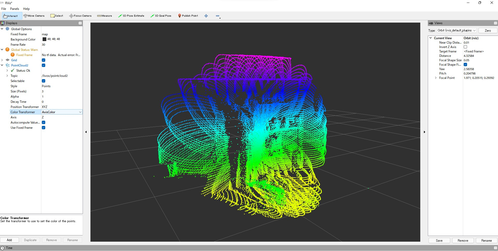
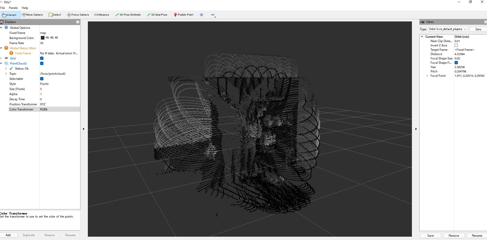

# ROS2 Livox Handler for Windows 

- unofficial ros2 package for handling livox lidars
- tested under following environment:
    - windows 11
    - ros2 galactic
    - livox sdk v2.3.0
    - livox avia

# Prerequisite

- install Livox SDK according to windows install instructions
- build based on visual studio 2019
- copy /lib/livox_sdk_static.lib here

# run 

```
run ros2_win_livox_handler ros2_win_livox_handler
```

# rviz2 views

- point color : axis-z



- point color : intensity 
  - each point's instensity is represented as rgb attribute



